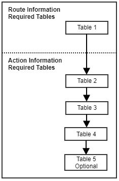

<h1>

    
        Required Fields
    
    Section A

</h1>
<h2>
Part 2
</h2>
  

Below shows a diagram of the fields that will be required depending on the data you have.
A simple scenario of the two cases:   
1.	__Route information__ may include the data received from a Planning tool which provides you with a vehicles route and stops to be made for a specific period. This also including action information defined in point 2 below.

2.	__Action information__ includes data about the stop to be made. This may be invoice data, delivery notes, interbranch transfers, collections etc. Additional information with this is required such as the address of the stop to be made as well as any extra functionalities that trackmatic can provide per stop. These extra functionalities can be seen in the required fields. 

<h2 style="text-align:center">Route Information</h2>

__Table 1__ : Route – This is the header information for the sequence of stops for a vehicle within an                                                               allocated period.  
__Table 2__ : Action – Type of stop to be made. (Delivery, Collection, IBT, etc).  
__Table 3__ : Entity – This is essential the sell to.  
__Table 4__ : Deco – This is essential the ship to.  
__Table 5__ : Handling Units –  Individual items been delivered (optional).  

## Table 1

__ROUTE__  
A basic example of a route in trackmatic is the travel path in which a delivery is to be made.

|   | Field Name           | Mandatory  |  Description                                                                    |                                                                 
| :------------------------|------------| :------------:| :--------------------------------------------------------------:|
| 1 | Reference            | Yes        | A unique reference number for the route                                         |
| 2 | Planned Start        | Yes        | Planned start date and time                                                     |
| 3 | Registration         | No         | Registration number of the vehicle being assigned to the route                  |
| 4 | Name                 | No         | A name or number of the route                                                   |
|CREW                                                                                                                     |
| 5 | Reference            | Yes        | Personnel Unique Identifier issued by Client                                    |
| 6 | Name                 | Yes        | Personnel Name                                                                  |
| 7 | Type                 | Yes        | Personnel Type (Driver or Crew)                                                 |
| 8 | Identity No.         | No         | Identity number of crew member                                                  |
| 9 | Cell No.             | No         | Cell phone number of crew member                                                |

<h2 style="text-align:center">Action Information</h2>

__Table 2__ : Action – Type of stop to be made. (Delivery, Collection, IBT, etc).  
__Table 3__ : Entity – This is essential the sell to.  
__Table 4__ : Deco – This is essential the ship to.  
__Table 5__ : Handling Units –  Individual items been delivered (optional).  

## Table 2

__ACTION__  
A basic example of an action in trackmatic is an invoice along with its details for who the customer is for.

|    | Field Name          | Mandatory  |  Description                                                                    |                                                                 
| :------------------------|------------| :------------:| :--------------------------------------------------------------:|
| 1  | IsCod               | Yes        | Cash On Delivery Indicator                                                      |
| 2  | Reference           | Yes        | Unique reference number associated with the action                              |
| 3  | Volumetric Mass     | No         | The volume of the parcel                                                        |
| 4  | Weight              | No         | Weight of the parcel                                                            |
| 5  | Pieces              | No         | Number of pieces in the action                                                  |
| 6  | Unit                | No         | Unit of measure                                                                 |
| 7  | Instructions        | No         | Special instructions                                                            |
| 8  | Customer Reference  | No         | Client supplied reference number                                                |
| 9  | Customer Code       | No         | Unique client code                                                              |
| 10 | Expected Delivery   | No         | Date the action is expected to be executed                                      |
| 11 | Pallets             | No         | Number of pallets associated with the action                                    |
| 12 | Amount Incl         | No         | Monetary value of the action including vat                                      |
| 13 | Amount Excl         | No         | Monetary value of the action excluding vat                                      |
| 14 | Reference_Internal  | No         | Internal reference number for workflow i.e. picking slip, sales doc etc         |

## Table 3

__ENTITY__  
A basic example of an entity in trackmatic is the individual stores/customers details within an area(Edgars in Mall Of Africa).

|    | Field Name          | Mandatory  |  Description                                                                                                                             |                                                
| :------------------------|------------| :------------:| :-----------------------------------------------------------------------------------------------------------------------:|
| 1  | Name                | Yes        | The name of the entity                                                                                                                   |
| 2  | Reference           | Yes        | A unique reference number for the entity (Sell-to identifier)                                                                            |
|CONTACT                                                                                                                                                                           |
| 3  | First Name          | No         | First name of the contact                                                                                                                |
| 4  | Last Name           | No         | Last name of the contact                                                                                                                 |
| 5  | Tel No              | No         | Telephone number of the contact                                                                                                          |
| 6  | Cell No             | No         | Cell phone number of the contact                                                                                                         |
| 7  | Email               | No         | Email address of the contact                                                                                                             |
|REQUIREMENTS                                                                                                                                                                      |
| 8  | Action Debrief      | No         | Success or Failure of the action that was to be executed.Per entity, it can be stated if you would like an entity debrief.               |
| 9  | Cod Debrief         | No         | Review of Cod deliveries 1) EFT POP 2) Cash 3) No Cash 4) Accouting Pin. Per entity, it can be stated if you would like a Cod debrief.   |
| 10 | Signature           | No         | Sign On Glass required after an action is debriefed. Per entity, it can be stated if you would like the signature feature.               |

## Table 4

__LOCATION__  
A basic example of a LOCATION in trackmatic is the area/location of the entities (Mall Of Africa has entities like Edgars, Woolworths etc.).

|    | Field Name          | Mandatory  |  Description                                                                    |                                                                 
| :------------------------|------------| :------------:| :--------------------------------------------------------------:|
| 1  | Reference           | Yes        | A unique reference number (Ship-to Identifier)                                  |
| 2  | Name                | Yes        | Common name of the DECO                                                         |
|ADDRESS                                                                                                                  |
| 3  | AddressId           | Dependant  | Mandatory if 3PL or you may have multiple delivery addresses                    |
| 4  | IsAdhoc             | No         | Once of stop                                                                    |
| 5  | Unit No.            | No         | Unit No.                                                                        |
| 6  | Building Name       | No         | Building Name                                                                   |
| 7  | Street No.          | No         | Street No.                                                                      |
| 8  | Sub Division No.    | No         | Sub Division No.                                                                |
| 9  | Street              | No         | Street                                                                          |
| 10 | Suburb              | No         | Suburb                                                                          |
| 11 | Province            | No         | Province                                                                        |
| 12 | Postal Code         | No         | Postal Code                                                                     |
| 13 | Map Code            | No         | Map Code                                                                        |
| 14 | Latitude            | No         | Latitude                                                                        |
| 15 | Longitude           | No         | Longitude                                                                       |
| 16 | MST                 | No         | Maximum service time                                                            |

## Table 5

__HANDLING UNITS__  
A basic example of a handling unit in trackmatic is the individual items/materials/goods that are been delivered.

|    | Field Name          | Mandatory  |  Description                                                                    |                                                                 
| :------------------------|------------| :------------:| :--------------------------------------------------------------:|
| 1  | Barcode             | Yes        | Barcode of the handling unit                                                    |
| 2  | Unit of measure     | Yes        | Describes the type of handling unit (carton, parcel, box)                       |
| 3  | Customer Reference  | No         | Client supplied ref number                                                      |
| 4  | Quantity            | No         | Amount of parcels in the handling unit                                          |
| 5  | Weight              | No         | Weight of the handling unit                                                     |
| 6  | Status              | No         | Status of the handling unit (pending, endorsed, rejected, missing)              |
| 7  | Description         | No         | Description of handling unit                                                    |
| 8  | Volume              | No         | Volume of the parcel                                                            |
| 9  | Volumetric Mass     | No         | Volumetric mass of the parcel                                                   |
|DIMENSIONS                                                                                                               |
| 10 | Height              | No         | Height of handling unit                                                         |
| 11 | Width               | No         | Width of handling unit                                                          |
| 12 | Length              | No         | Length of handling unit                                                         |
| 13 | Amount Excl         | No         | Monetary value of the action excluding vat                                      |

