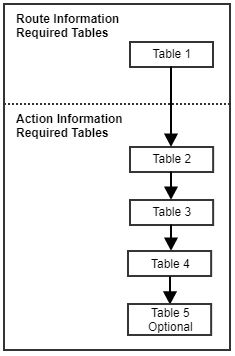

<h1 style="text-align: center;">
Section A
</h1>

# Part 2

Below shows a diagram of the fields that will be required depending on the data you have.
A simple scenario of the two cases:
1.	__Route information__ may include the data received from a Planning tool which provides you with a vehicles route and stops to be made for a specific period. This also including action information defined in point 2 below.

2.	__Action information__ includes data about the stop to be made. This may be invoice data, delivery notes, interbranch transfers, collections etc. Additional information with this is required such as the address of the stop to be made as well as any extra functionalities that trackmatic can provide per stop. These extra functionalities can be seen in the required fields. 

