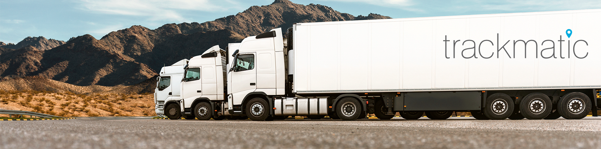
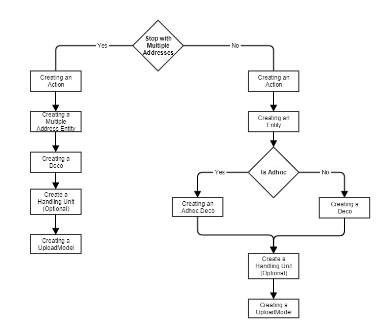

## 
# Welcome

Welcome to the Trackmatic integration guide. This guide will take you through various business cases and technical concepts which you will need to successfully integrate with Trackmatic.

## What We Do

In short, Trackmatic provides unique tailor-made software solutions to fleet operators and fleet management of On-Road Execution™ regardless of the fleet size. 
  
We offer a holistic business solution to our clients, meeting their unique and complex requirements. We work together with them to provide insight into the finer workings of their operations, thereby increasing efficiencies and enabling greater levels of satisfaction among their customers.

Resource optimisation and service excellence are key outcomes of the solution, resulting in higher profits and driving down costs. This is where the true value of the solution is gained.

### [How To Use This Guide](contents/HowToUseThisGuide.md)

### [Fleet](rest/fleet)



### [Tracking](rest/tracking)



### [Loads](rest/loads)



## 